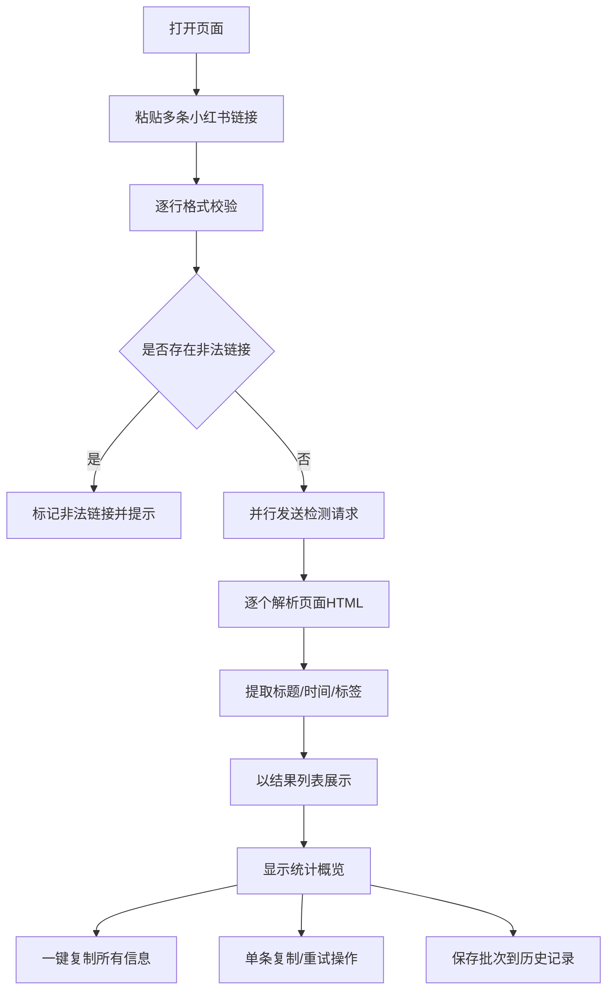

## 1. 产品概述

小红书笔记链接审核工具，帮助运营人员快速验证小红书笔记链接有效性并提取关键信息（标题、发布时间、标签），提升内容审核效率。

## 2. 核心功能

### 2.1 功能模块

1. **链接输入与审核页面**：核心单页应用，包含链接粘贴、格式校验、有效性检测、信息提取与展示

### 2.2 页面详情

| 页面名称 | 模块名称 | 功能描述 |
|---------|---------|---------|
| 审核主页 | 批量链接输入区 | 支持一次性粘贴多条小红书链接（至少5条），换行分隔，自动格式校验 |
| 审核主页 | 批量链接有效性检测 | 并行发送请求检测所有链接是否可访问，实时显示每条链接的检测状态 |
| 审核主页 | 批量信息提取展示 | 以结果列表/卡片形式展示所有笔记的标题、发布时间、标签列表 |
| 审核主页 | 批量操作 | 支持一键复制所有有效笔记的信息，导出为表格格式（CSV/JSON） |
| 审核主页 | 单条操作 | 每条结果支持单独复制链接、复制信息、重新检测 |
| 审核主页 | 历史记录 | 本地存储最近审核的批次记录，支持快速回溯 |
| 审核主页 | 统计概览 | 展示总链接数、有效数、无效数、提取成功率等统计信息 |

## 3. 核心流程

用户打开页面 -> 粘贴多条小红书链接（换行分隔） -> 点击"批量检测" -> 系统逐行正则校验格式 -> 并行发送检测请求 -> 逐个解析HTML提取标题/时间/标签 -> 以结果列表展示所有笔记 -> 显示统计概览 -> 用户可一键复制所有信息或单条操作

## 4. 用户界面设计

### 4.1 设计风格

- **主色调**：小红书品牌红 `#FF2442` 作为强调色，搭配纯净白底与深灰文字
- **按钮样式**：圆角药丸形状（border-radius: 9999px），主按钮使用品牌红渐变，悬浮时有轻微上移阴影
- **字体**：标题使用 "Noto Sans SC" 或系统黑体，正文使用系统默认无衬线字体
- **布局风格**：居中卡片式布局，大圆角（24px），柔和阴影，整体简洁专业
- **图标风格**：使用 Lucide 图标，线条简洁，与文字搭配协调

### 4.2 页面设计概述

| 页面名称 | 模块名称 | UI元素 |
|---------|---------|--------|
| 审核主页 | 顶部标题区 | 大标题"小红书笔记审核工具"，副标题说明用途，小红书Logo装饰 |
| 审核主页 | 批量输入区 | 多行文本域，支持粘贴至少5条链接，自动识别并高亮非法链接，显示链接计数 |
| 审核主页 | 统计概览栏 | 检测完成后顶部显示总链接数、有效/无效数量、成功率 |
| 审核主页 | 状态指示 | 每条结果独立显示加载动画（旋转红点）、成功绿色勾选、失败红色警告 |
| 审核主页 | 结果列表 | 卡片式或表格形式展示所有笔记信息，包含序号、标题、时间、标签、状态 |
| 审核主页 | 批量操作栏 | 一键复制全部有效信息、导出CSV/JSON、清空结果 |
| 审核主页 | 单条操作 | 每条结果支持单独复制链接、复制信息、重新检测 |
| 审核主页 | 历史记录 | 侧边栏或底部折叠面板，展示最近批次记录，可恢复查看 |

### 4.3 响应式设计

- 桌面端：居中布局最大宽度 960px，输入区占满宽度，结果列表以表格/卡片网格展示，历史记录右侧边栏
- 移动端：全宽布局，输入区垂直扩展，结果列表垂直堆叠卡片，历史记录底部折叠面板

### 4.4 动画效果

- 页面加载：标题和输入区淡入上浮（stagger 0.1s）
- 检测中：输入框边框红色脉冲动画，加载器旋转
- 结果出现：卡片从下方滑入（translateY 20px -> 0, opacity 0 -> 1, 0.4s ease-out）
- 标签出现：stagger 延迟 0.05s 逐个淡入
- 按钮悬浮：scale 1.02，阴影加深
- 错误提示：输入框左右轻微晃动（shake 动画）