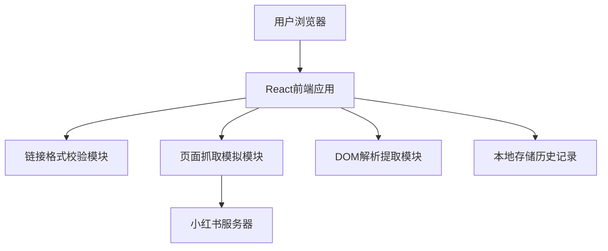

## 1. 架构设计



纯前端架构，无后端服务。利用浏览器CORS请求或代理服务获取小红书页面内容。

## 2. 技术描述

- **前端框架**: React 18 + Vite
- **样式方案**: Tailwind CSS 3
- **UI组件库**: shadcn/ui（输入框、按钮、卡片、标签、Toast通知）
- **图标库**: Lucide React
- **数据获取**: 原生 fetch API（通过 cors-anywhere 或类似公开代理解决CORS限制）
- **本地存储**: localStorage 存储历史记录
- **动画**: Framer Motion 实现页面加载和交互动画

## 3. 路由定义

| 路由 | 用途 |
|-----|------|
| /   | 审核主页（单页应用） |

## 4. API定义

无后端API，前端直接请求小红书页面：

```typescript
// 批量获取小红书页面内容
const fetchXiaohongshuPages = async (urls: string[]): Promise<Map<string, string>> => {
  const results = new Map<string, string>();
  await Promise.all(
    urls.map(async (url) => {
      try {
        const proxyUrl = `https://api.allorigins.win/raw?url=${encodeURIComponent(url)}`;
        const response = await fetch(proxyUrl);
        if (response.ok) {
          results.set(url, await response.text());
        }
      } catch (e) {
        // 失败时不在map中设置该url
      }
    })
  );
  return results;
};
```

## 5. 数据模型

### 5.1 笔记信息类型

```typescript
interface NoteInfo {
  url: string;
  title: string;
  publishTime: string;
  tags: string[];
  isValid: boolean;
  status: 'pending' | 'checking' | 'success' | 'error';
  errorMsg?: string;
  checkedAt: string; // ISO 8601
}

interface BatchRecord {
  id: string; // UUID
  checkedAt: string;
  totalCount: number;
  validCount: number;
  invalidCount: number;
  notes: NoteInfo[];
}
```

### 5.2 本地存储结构

```typescript
// localStorage key: xhs-audit-batches
// 最多存储 10 个批次记录，新批次插入头部，超出时移除尾部
const batches: BatchRecord[] = JSON.parse(localStorage.getItem('xhs-audit-batches') || '[]');
```

## 6. HTML解析策略

使用 DOMParser 解析获取的HTML，通过 meta 标签和特定选择器提取信息：

```typescript
const parseNoteInfo = (html: string, url: string): NoteInfo => {
  const parser = new DOMParser();
  const doc = parser.parseFromString(html, 'text/html');
  
  // 尝试从 og:title meta 标签获取标题
  const title = doc.querySelector('meta[property="og:title"]')?.getAttribute('content') 
    || doc.querySelector('title')?.textContent 
    || '未找到标题';
  
  // 尝试从特定脚本或meta获取发布时间
  const publishTime = extractPublishTime(doc);
  
  // 提取标签（从meta keywords或页面内容）
  const tags = extractTags(doc);
  
  return { url, title, publishTime, tags, isValid: true, checkedAt: new Date().toISOString() };
};
```

## 7. 关键实现细节

### 7.1 CORS解决方案
由于小红书直接请求会触发CORS限制，使用公开代理服务：
- 首选: `https://api.allorigins.win/raw?url=`
- 备选: `https://corsproxy.io/?`

### 7.2 错误处理
- 链接格式错误：正则校验不通过时即时提示
- 请求超时：设置 15 秒超时，提示检查网络或链接
- 解析失败：页面可访问但结构不符时，展示友好提示

### 7.3 安全考虑
- 所有用户输入的URL先经过正则校验，只允许 xiaohongshu.com 域名
- 代理请求只发送 GET 请求，不携带敏感信息
- 历史记录只存储在本地，不上传到任何服务器